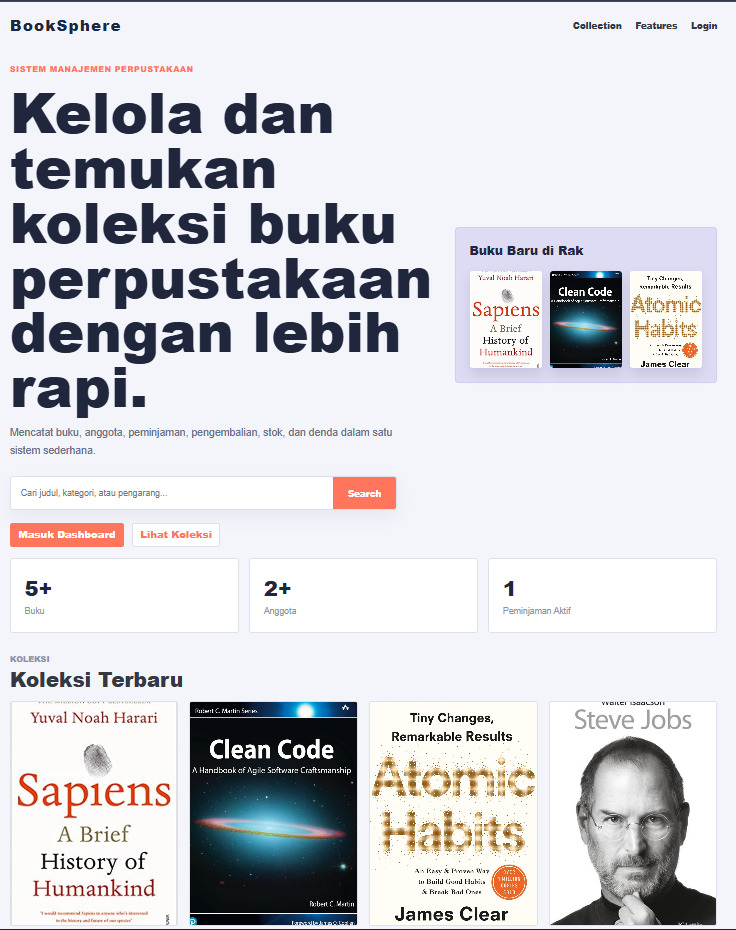
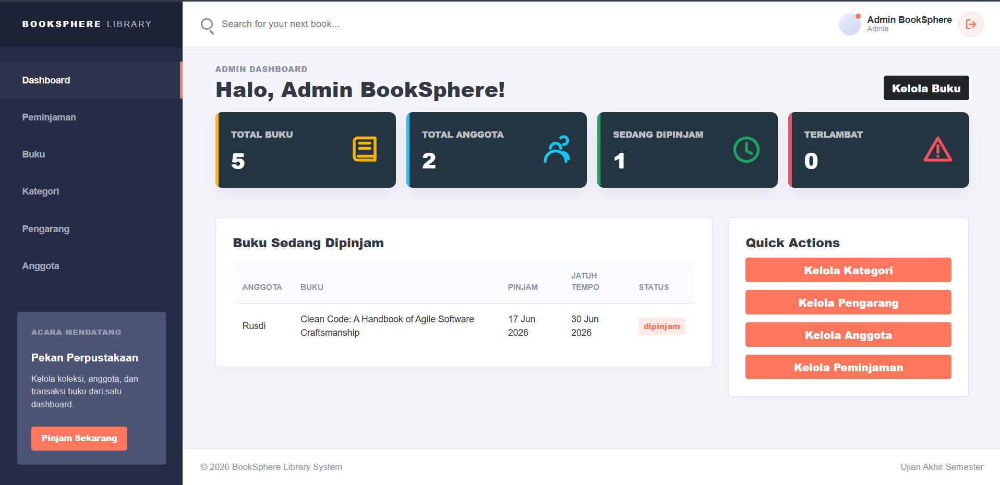
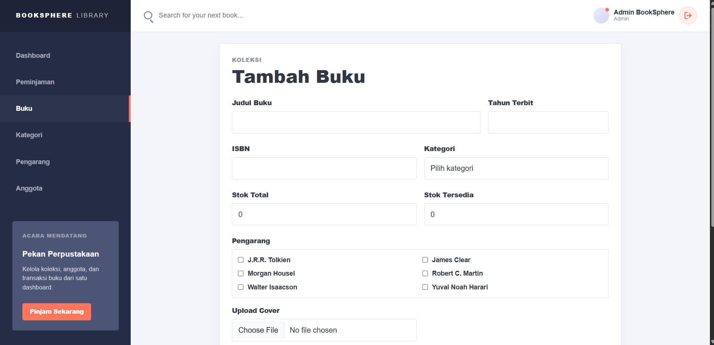
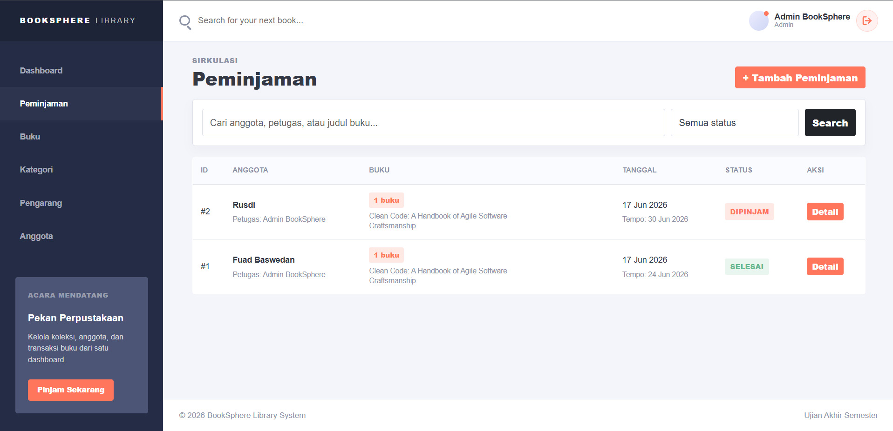
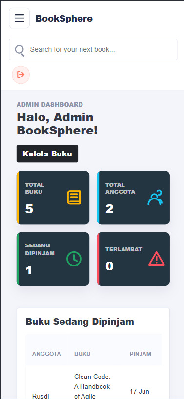

## 👨‍💻 Profil Mahasiswa
- **Nama:** Yahmudi Alih
- **NIM:** 25/567169/SV/27155
- **Program Studi:** Teknologi Rekayasa Perangkat Lunak

# 📚 BookSphere - Digital Library Management System

BookSphere adalah sebuah Sistem Manajemen Perpustakaan berbasis web yang dikembangkan menggunakan **PHP** dan **MySQL**. Proyek ini dibuat untuk memenuhi Tugas Ujian Akhir Semester (UAS) mata kuliah Praktikum Pemrograman Web 1.

Sistem ini tidak hanya mengelola data master secara terstruktur, tetapi juga menangani sirkulasi peminjaman buku dengan logika relasional yang kuat, termasuk pemotongan stok otomatis dan perhitungan denda menggunakan fitur *Trigger* dan *Stored Function* pada MySQL.

## ✨ Fitur Utama
- **Autentikasi Aman:** Sistem Login menggunakan enkripsi `password_hash()` dan manajemen sesi (Session) yang aman.
- **Manajemen Data Master (CRUD):** - Kelola Data Buku (Terintegrasi dengan upload gambar sampul).
  - Kelola Kategori & Pengarang (Mendukung relasi *Many-to-Many* dengan buku).
  - Kelola Data Anggota.
- **Sirkulasi Peminjaman (Transaksi):**
  - Validasi stok buku sebelum dipinjam.
  - Rekam jejak peminjaman dan pengembalian buku secara detail.
- **Database Cerdas (Advanced MySQL):**
  - **Triggers:** Pengurangan dan penambahan stok buku secara otomatis (`trg_pinjam_buku`, `trg_kembali_buku`).
  - **Functions:** Perhitungan denda keterlambatan secara dinamis dari database (`fn_hitung_denda`).
  - **Views:** Penyederhanaan *query* kompleks untuk laporan *dashboard* (`vw_buku_lengkap`, `vw_buku_dipinjam`).
- **UI/UX Modern:** Desain antarmuka responsif menggunakan **Bootstrap 5** dan validasi form interaktif menggunakan **JavaScript**.

## ⚙️ Struktur Folder Proyek

### 📂 Struktur Folder Proyek
```text
booksphere/
├── assets/
│   ├── css/
│   │   └── style.css
│   ├── js/
│   │   ├── validasi.js
│   │   └── interaktif.js
│   └── img/
│       ├── cover/              -> Folder upload sampul buku
│       └── default-cover.jpg
├── includes/
│   ├── config.php              -> Koneksi MySQLi + Kredensial
│   ├── functions.php           -> Helper PHP (format tanggal, dsb)
│   ├── auth.php                -> Cek session, redirect jika belum login
│   ├── header.php              -> Navbar + Head HTML
│   └── footer.php
├── pages/
│   ├── kategori/
│   │   └── index.php, tambah.php, edit.php, hapus.php
│   ├── pengarang/
│   │   └── index.php, tambah.php, edit.php, hapus.php
│   ├── buku/
│   │   └── index.php, tambah.php, edit.php, hapus.php, detail.php
│   └── peminjaman/
│       └── index.php, tambah.php, detail.php, kembalikan.php
├── login.php
├── logout.php
├── dashboard.php
├── index.php                   -> Landing page publik
├── database.sql
├── .gitignore
└── README.md
```

## 🚀 Teknologi yang Digunakan
- **Frontend:** HTML5, CSS3, JavaScript (Vanilla), Bootstrap 5.
- **Backend:** PHP 8+.
- **Database:** MySQL / MariaDB (Prepared Statements untuk keamanan dari SQL Injection).

## 🛠️ Cara Instalasi & Menjalankan Proyek
1. Pastikan Anda telah menginstal web server lokal seperti **XAMPP** atau **Laragon**.
2. *Clone* repositori ini menggunakan Git, atau *download* sebagai file ZIP:
   `git clone https://github.com/thanos-alt7/booksphere-uas.git`
3. Pindahkan folder proyek ke dalam direktori *document root* server Anda:
   - XAMPP: Masukkan ke folder `htdocs`.
   - Laragon: Masukkan ke folder `www`.
4. Buka **phpMyAdmin** (`http://localhost/phpmyadmin`), lalu buat database baru dengan nama `perpustakaan_db`.
5. Import file **`database.sql`** yang ada di folder utama proyek ke dalam database tersebut.
6. Akses proyek melalui web browser di: `http://localhost/booksphere-uas` (Sesuaikan dengan nama folder Anda).


## 📸 Dokumentasi / Screenshot

### 1. Halaman Beranda (Landing Page Publik)


### 2. Dashboard Admin & Data Buku


### 3. Form Tambah Data (Validasi JS)


### 4. Transaksi Peminjaman Buku


### 5. Tampilan Mobile (Responsif)


---
*Made with loveeeee - 2026*